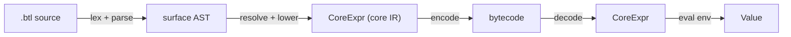

# btclisp

A compiler and VM for a small Lisp-style language that targets a reduced subset
of ajtowns' [BTC Lisp](https://delvingbitcoin.org/t/btc-lisp-a-lisp-for-bitcoin/682)
(Delving Bitcoin #682). Written in Rust, it runs offline and against a
`bitcoind` regtest node via `rust-bitcoin`.

**Status:** v0,1 — feature-complete against the spec goals. 164 tests pass; the
codec round-trips under proptest; BIP340/BIP341 are validated against reference
vectors; and a taproot commitment to a compiled program is funded and spent on a
live regtest node.

See [`spec.md`](spec.md) for the full specification and
[`docs/architecture/`](docs/architecture) for design decisions (ADRs).

## What it does

End-to-end pipeline: source `.btl` → surface AST → core IR (`CoreExpr`) → bytes
→ eager evaluation against an environment.



- ~25 core opcodes (a subset of ajtowns' table): control (`q a x i`), lists
  (`c h t l b`), arithmetic/compare (`+ - * % /% < =`), booleans (`not all any`),
  bytes (`cat substr strlen rd wr`), hashing (`sha256 hash160 hash256`),
  signatures (`bip340_verify`), and transaction introspection (`tx`,
  `bip342_txmsg`).
- Surface sugar (`defun`, `let`, `if`, `cond`, quote) with direct self-recursion
  via auto-quine lowering.
- A canonical binary codec (ajtowns' encoding table) with a proptest round-trip.
- Real Bitcoin glue: BIP340 Schnorr verification (`secp256k1`) and BIP341
  taproot sighashes (`rust-bitcoin`).

## Quick start

Requires a stable Rust toolchain (MSRV 1.80).

```sh
cargo build
cargo test                 # 164 tests
cargo bench -p btclisp-vm --bench pipeline
```

The CLI is `btclispc`:

```sh
# Inspect: lex + parse + resolve, and show the lowered core
cargo run -p btclisp-cli -- check --core examples/02_factorial.btl

# Compile to bytes (raw to a file, or hex to stdout)
cargo run -p btclisp-cli -- compile examples/02_factorial.btl -o fact.bin

# Disassemble to mnemonics (or --raw for hex atoms)
cargo run -p btclisp-cli -- disasm fact.bin
#   (a (q . <body>) (c (q . <body>) (c (q . 0x05) (q . ()))))

# Run it
cargo run -p btclisp-cli -- run fact.bin          # -> 0x78  (= 120)

# Run with a witness environment and/or a transaction
cargo run -p btclisp-cli -- run hashlock.bin --env <hex>
cargo run -p btclisp-cli -- run csv.bin --tx <rawtx-hex> --env <hex>
```

### Regtest

With [Nigiri](https://nigiri.vulpem.com) running (`nigiri start`):

```sh
cargo test -p btclisp-cli --features regtest -- --nocapture
```

This commits a compiled program to a real P2TR output, funds it, and broadcasts
a spend. **Note:** bitcoind cannot *execute* btclisp (it is a proposed opcode
set, not a deployed softfork), so on-chain settlement uses the taproot key path
while the script-path semantics are validated off-chain by the VM — exactly what
a btclisp-aware validator would enforce.

## Size comparison: btclisp vs Bitcoin Script

Committed tapleaf size for the same spending conditions (from the
[`examples/`](examples) corpus). btclisp parameterises its logic through the
**witness environment**, so the committed script holds *logic only*; an
equivalent Bitcoin tapscript **embeds** the pubkeys/hashes. Signatures live in
the witness for both.

| Spending condition      | btclisp script | Bitcoin tapscript | Note |
|-------------------------|---------------:|------------------:|------|
| P2PK                    |          6 B   |             ~34 B | pubkey in the env, not the script |
| Hashlock (SHA-256)      |          6 B   |             ~35 B | target hash in the env |
| CSV / absolute timelock |          6 B   |              ~6 B | comparable; deadline in the env |
| 2-of-3 multisig         |         25 B   |            ~104 B | three pubkeys in the env (tapscript uses `CHECKSIGADD`) |
| Factorial (recursion)   |         74 B   |                 — | no Bitcoin Script equivalent — Script has no recursion |

The headline points: parameterising via the environment shrinks the committed
script, and btclisp expresses computation (recursion, list processing) that
Bitcoin Script cannot.

## Workspace layout

```
crates/
  core/       # CoreExpr IR, opcode table, s-expr renderer        (~410 LOC)
  compiler/   # lexer, parser, AST, resolve, lowering             (~2250 LOC)
  codec/      # CoreExpr <-> bytes, disassembler, round-trip       (~630 LOC)
  vm/         # eager interpreter, ops, bitcoin glue, benches     (~1490 LOC)
  cli/        # btclispc binary, regtest harness                   (~340 LOC)
examples/     # 01-07 corpus: .btl + .bin.hex + .expected
docs/         # architecture decision records
spec.md       # the specification (edit token BTL01A)
```

Crate dependencies (no cycles): `cli → {compiler, codec, vm}`, `compiler → core`,
`codec → core`, `vm → {core, codec}`.

## Known limitations (v0,1)

- **Non-capturing scopes.** Nested `let`/`defun` bodies see only their own
  bindings; closures over outer variables arrive in v0,2 via a balanced
  env-tree. See [ADR 0001](docs/architecture/0001-environment-representation.md).
- **Mutual recursion** is rejected (direct self-recursion is supported).
- **Integers** are `u64`-pure little-endian (`+`/`*` wrap, `-` saturates);
  CScriptNum semantics are deferred to v0,2.
- **`bip342_txmsg`** supports `SIGHASH_DEFAULT` only.
- The `(tx N)` field codes are a documented v0,1 ABI, to be reconciled with
  ajtowns' exact table.

## Contributing

- `cargo fmt --all` and `cargo clippy --all-targets -- -D warnings` must pass.
- Typed errors via `thiserror` (no `anyhow` outside the CLI); no `unwrap`/`expect`
  outside tests and `cli::main`; no `unsafe`.
- Every public function carries a doc comment and at least one unit test.
- Conventional commits (`feat:`, `fix:`, `refactor:`, `test:`, `docs:`, …).
- Changes to `CoreExpr`, opcode bytes, env-ref encoding, the codec table, or
  public error variants should be discussed first (see `spec.md` §15).

## License

MIT.
