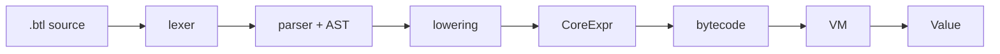

# btclisp

## do código fonte à VM

Uma linguagem Lisp pequena como estudo de caso de compiladores.

<div class="mt-10 text-sm opacity-70">
Disciplina de Compiladores · 25 min · Yan Barbara
</div>

<!--
Notas: abrir dizendo que Rust e Bitcoin aparecem no projeto, mas nesta apresentação eles são tratados como infraestrutura. O foco é: como o código fonte passa por etapas clássicas de compilador até virar algo executável.
-->

---

# Ideia central

O projeto implementa um pipeline completo:



O interessante para compiladores: todas as fases são pequenas o suficiente para explicar.

<!--
Notas: enfatizar que não é só parser; existe IR, serialização e runtime. Isso faz o projeto ser um exemplo completo.
-->

---

# O que é btclisp?

- Uma linguagem Lisp pequena.
- Sintaxe por S-expressions.
- Compila para uma IR chamada `CoreExpr`.
- Serializa para um bytecode canônico.
- Executa em uma VM eager.

```lisp
(+ 40 2)
```

Resultado esperado:

```txt
0x2a
```

<!--
Notas: explicar eager rapidamente: argumentos são avaliados antes da operação, exceto formas especiais como quote e if.
-->

---

# O que vamos tratar como black box

Para manter o foco em compiladores:

- **Rust**: linguagem de implementação.
- **Bitcoin/Taproot**: domínio real usado pelo projeto.
- **Criptografia**: operadores como hash e assinatura existem, mas não são o foco.

Hoje o foco é:

> Como uma linguagem pequena vira bytecode e depois resultado?

<!--
Notas: importante para a banca/professor: o projeto tem Bitcoin, mas a apresentação não depende de conhecimento profundo de Bitcoin.
-->

---

# Linguagem fonte

Exemplos de construções da superfície:

```lisp
(+ 1 2)

(let ((x 40)
      (y 2))
  (+ x y))

(if (< n 2)
    1
    (* n (fact (- n 1))))
```

Recursos implementados:

- Literais: inteiros, hex, strings, `nil`.
- Aplicações: `(<op> arg...)`.
- Sugar: `defun`, `let`, `if`, `cond`, quote.

---

# Fase 1 — Lexer

Entrada: texto.

Saída: tokens com `span`.

```lisp
(+ 40 2)
```

vira algo como:

```txt
LParen, Sym("+"), Int(40), Int(2), RParen
```

Por que `span` importa?

- Diagnóstico de erro.
- Mensagens apontando para a posição correta no fonte.
- Base para ferramentas como formatter e checker.

---

# Fase 2 — Parser

O parser é recursivo-descendente.

Ele transforma tokens em AST:

```txt
Expr::App {
  head: "+",
  args: [Int(40), Int(2)]
}
```

Por que isso importa?

- A árvore preserva a estrutura do programa.
- O compilador deixa de lidar com texto cru.
- Erros sintáticos ficam localizados.

---

# AST de superfície

A AST entende a linguagem que o usuário escreve:

- `Expr::Atom`
- `Expr::App`
- `Expr::Let`
- `Expr::If`
- `Expr::Cond`
- `Expr::Quote`
- `Form::Defun`

Mas a VM não executa essa AST diretamente.

Ela precisa ser simplificada para uma IR menor.

<!--
Notas: aqui conectar com a ideia clássica de desugaring/lowering: sair de uma linguagem amigável para uma linguagem núcleo.
-->

---

# Fase 3 — Lowering

Lowering transforma a AST de superfície em uma linguagem núcleo.

Exemplos:

- `let` vira aplicação com ambiente novo.
- `if` vira uma forma especial com branches quotados.
- Variáveis viram caminhos numéricos no ambiente.
- Chamadas de função são inlined em v0.1.

---

# IR — CoreExpr

A IR tem só três formas:

```rust
enum CoreExpr {
    Nil,
    Atom(Bytes),
    Cons(Box<CoreExpr>, Box<CoreExpr>),
}
```

Ou seja:

- lista vazia;
- átomo de bytes;
- par/cons cell.

Todo programa vira essa árvore mínima.

<!--
Notas: Lisp clássico: listas como estrutura universal. O projeto usa isso para ter uma IR pequena e serializável.
-->

---

# Variáveis como caminhos no ambiente

Em vez de nomes em runtime:

```lisp
(+ a b)
```

o lowering transforma variáveis em referências posicionais:

```txt
a -> 2
b -> 5
c -> 11
```

Ambiente flat:

```txt
(a . (b . (c . nil)))
```

Vantagem: a VM não precisa resolver nomes.

<!--
Notas: explicar como analogia de compilador: nomes somem depois da análise; runtime usa offsets/endereços.
-->

---

# Bytecode canônico

Depois da IR:

```txt
CoreExpr -> bytes
```

O codec garante round-trip:

```txt
decode(encode(expr)) == expr
```

Isso permite:

- salvar programas;
- comparar outputs com golden tests;
- disassemblar para uma forma legível.

---

# VM eager

A VM avalia `CoreExpr` contra um ambiente.

Formas especiais:

- `q`: quote, não avalia o argumento.
- `i`: if, avalia só a condição e o branch escolhido.
- `a`: apply, executa um programa em novo ambiente.
- `x`: exception.

Demais opcodes avaliam argumentos antes de executar.

---

# Demo ao vivo

Arquivo:

```txt
demo/presentation/01_add.btl
```

```lisp
(+ 40 2)
```

Comandos:

```sh
cargo run -p btclisp-cli -- check --core demo/presentation/01_add.btl
cargo run -p btclisp-cli -- compile demo/presentation/01_add.btl -o /tmp/btclisp-add.bin
cargo run -p btclisp-cli -- disasm /tmp/btclisp-add.bin
cargo run -p btclisp-cli -- run /tmp/btclisp-add.bin
```

---

# Demo extra — recursão

```lisp
(defun fact (n)
  (if (< n 2)
      1
      (* n (fact (- n 1)))))

(fact 5)
```

Resultado esperado:

```txt
0x78
```

Ponto conceitual:

- `defun` é açúcar de superfície.
- A função é baixada para `CoreExpr`.
- Recursão direta usa auto-quine.

---

# Estratégia de testes

O projeto testa cada fase:

- Unit tests no lexer, parser, lowering, codec e VM.
- Property tests no codec.
- Golden tests nos exemplos `.btl`.
- Testes end-to-end: compila e executa.
- Regtest Bitcoin existe, mas é fora do escopo desta apresentação.

Para a apresentação:

```sh
cargo fmt --all --check
cargo clippy --all-targets -- -D warnings
cargo test
```

---

# Limitações v0.1

- Escopos não capturam variáveis externas.
- Recursão mútua é rejeitada.
- Inteiros usam semântica `u64` little-endian.
- Custos de execução ainda são simples.
- Alguns detalhes de Bitcoin ficam como ABI v0.1.

Essas limitações são úteis didaticamente:

> mostram onde um compilador simples começa a virar um compilador mais completo.

---

# Conclusão

btclisp é um compilador completo:

```txt
texto -> tokens -> AST -> IR -> bytes -> VM -> resultado
```

O valor didático está em enxergar cada etapa separada:

- frontend;
- lowering/desugaring;
- representação intermediária;
- serialização;
- runtime.

Pergunta final:

> Que fase você mudaria primeiro para transformar isso em uma linguagem maior?

<!--
Notas: fechar apontando para v0.2: closures/env-tree, mutual recursion e sistema de tipos.
-->
